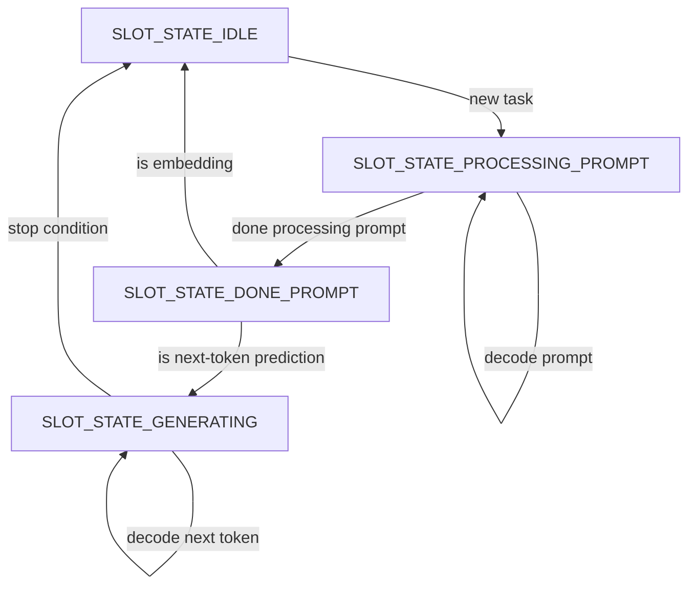

# Modulo kernel e instrumentazione di llama.cpp

## Indice dei Contenuti

- [1. Mappatura tramite `strace`](#mappatura-tramite-strace)
  - [Funzioni Target del Driver `virtio-gpu`](#funzioni-target-del-driver-virtio-gpu)
    - [Le Ioctl di Interfaccia Userspace-Kernel](#le-ioctl-di-interfaccia-userspace-kernel)
    - [Individuazione delle Funzioni Interne (Non-Ioctl)](#individuazione-delle-funzioni-interne-non-ioctl)
- [2. Kprobe vs Kretprobe](#kprobe-vs-kretprobe)
- [3. Analisi del Modulo Kernel `fault_injection.ko`](#analisi-del-modulo-kernel-fault_injectionko)
  - [Parametri di Selezione del Target](#parametri-di-selezione-del-target)
  - [Tipologie di Guasto Iniettabili](#tipologie-di-guasto-iniettabili)
  - [Corruzioni su `virtio_gpu_execbuffer_ioctl`](#corruzioni-su-virtio_gpu_execbuffer_ioctl)
    - [Caso 1: Azzeramento della Dimensione dei Comandi (`size = 0`)](#caso-1-azzeramento-della-dimensione-dei-comandi-size--0)
    - [Caso 2: Indice della Coda Invalido (`ring_idx = 0xFFFFFFFF`)](#caso-2-indice-della-coda-invalido-ring_idx--0xffffffff)
    - [Caso 3: Puntatore Comandi Corrotto (`command = 0xFFFFFFFF`)](#caso-3-puntatore-comandi-corrotto-command--0xffffffff)
  - [Corruzioni su `virtio_gpu_resource_create_blob_ioctl`](#corruzioni-su-virtio_gpu_resource_create_blob_ioctl)
    - [Caso 1: Troncamento della Dimensione con Allineamento a `PAGE_SIZE`](#caso-1-troncamento-della-dimensione-con-allineamento-a-page_size)
    - [Caso 2: Riduzione di `cmd_size` con Allineamento a 4 Byte](#caso-2-riduzione-di-cmd_size-con-allineamento-a-4-byte)
    - [Caso 3: Inversione del Flag di Mappabilità (`MAPPABLE`)](#caso-3-inversione-del-flag-di-mappabilit-mappable)
  - [Corruzioni su `virtio_gpu_queue_fenced_ctrl_buffer`](#corruzioni-su-virtio_gpu_queue_fenced_ctrl_buffer)
    - [Caso 1: Bit-Flip nel Payload](#caso-1-bit-flip-nel-payload)
    - [Caso 2: Corruzione del Tipo di Comando (Opcode Invalido)](#caso-2-corruzione-del-tipo-di-comando-opcode-invalido)
    - [Caso 3: Troncamento della Dimensione del Comando all'Header](#caso-3-troncamento-della-dimensione-del-comando-allheader)
  - [Corruzioni su `virtio_gpu_cmd_submit`](#corruzioni-su-virtio_gpu_cmd_submit)
    - [Caso 1: Troncamento Pacchetto VirtIO / Buffer Underrun (`data_size = 4`)](#caso-1-troncamento-pacchetto-virtio--buffer-underrun-data_size--4)
    - [Caso 2: Violazione del Protocollo Venus (Opcode Invalido `0xDEAD`)](#caso-2-violazione-del-protocollo-venus-opcode-invalido-0xdead)
    - [Caso 3: Descrittore Nullo di Memoria Condivisa (`ring pointer = NULL`)](#caso-3-descrittore-nullo-di-memoria-condivisa-ring-pointer--null)
- [4. Instrumentazione `llama.cpp`](#instrumentazione-llamacpp)
  - [Configurazione tramite Variabili d'Ambiente](#configurazione-tramite-variabili-dambiente)
  - [Isolamento del Thread](#isolamento-del-thread)
  - [Macchina a Stati per il Target "PREFILL" vs "DECODE"](#macchina-a-stati-per-il-target-prefill-vs-decode)
- [5. Guida all'Uso ed Esecuzione](#guida-alluso-ed-esecuzione)
  - [Caricamento del Modulo nel Kernel](#caricamento-del-modulo-nel-kernel)
  - [Esecuzione](#esecuzione)

---

## Mappatura tramite `strace`

Prima di sviluppare il modulo, è stato fondamentale comprendere come l'inferenza di `llama.cpp` si traducesse in interazioni con la GPU virtualizzata. È stato utilizzato `strace` per tracciare le System Call di tipo `ioctl` dirette al driver grafico.

```bash
strace -f -tt -e trace=ioctl ~/llama.cpp/build/bin/llama-cli \
    -m qwen2.5-0.5b-instruct-q4_k_m.gguf -p "A ball is in a yellow box..."
```

L'analisi dell'output ha permesso di individuare specifiche chiamate del driver `drm/virtgpu` (es. `virtio_gpu_execbuffer_ioctl`, `virtio_gpu_resource_create_blob_ioctl`). Questo ha fornito i target precisi da agganciare nel kernel.


### Funzioni Target del Driver `virtio-gpu`

L'indagine ha portato alla selezione di quattro funzioni nel driver del kernel Linux, suddivise tra ioctl e routine interne di gestione del flusso:

#### Le Ioctl di Interfaccia Userspace-Kernel
Dall'output di `strace` sono emerse le due ioctl principalmente utilizzate durante le varie fasi di esecuzione di `llama.cpp`:
- `virtio_gpu_execbuffer_ioctl`: è l'ioctl impiegata dal driver userspace (nel nostro caso Mesa/Vulkan) per sottomettere batch di comandi. Riceve la struttura `drm_virtgpu_execbuffer` contenente puntatori ai comandi e ai descrittori di sincronizzazione, passandoli poi all'infrastruttura kernel per l'inoltro all'host.
- `virtio_gpu_resource_create_blob_ioctl`: è l'ioctl dedicata all'allocazione delle risorse di memoria. Con l'introduzione del backend Venus per Vulkan, questa chiamata permette di creare "Blob Resources", ovvero buffer di memoria condivisa, essenziali per il caricamento dei pesi e dati in modalità zero-copy.

#### Individuazione delle Funzioni Interne (Non-Ioctl)
Oltre alle ioctl direttamente visibili da userspace, sono state indagate le funzioni interne al driver che gestiscono a basso livello l'invio di comandi verso l'acceleratore paravirtualizzato. Per identificarle è stata condotta un'analisi statica del codice sorgente del driver `virtio-gpu` nel kernel Linux, arrivando a concentrarsi sui file ritenuti più pertinenti:
- `virtgpu_vq.c`: file deputato alla gestione operativa delle code VirtIO (virtqueue).
- `virtgpu_submit.c`: file responsabile dell'impacchettamento e della sottomissione dei comandi.

Poiché molte funzioni interne del kernel potrebbero non essere effettivamente impiegate durante un carico di tipo compute/LLM, è stato adottato un metodo di validazione empirica a runtime.
Nel modulo kernel `fault_injection.c` sono state temporaneamente inserite delle stampe di "ricognizione" nell'entry handler. Caricando il modulo puntando alla funzione desiderate, avviando l'inferenza di `llama.cpp` e monitorando le tracce in `dmesg`, è stato possibile verificare quali funzioni venissero realmente invocate, scartando quelle inattive. Da questo screening sono state scelte due funzioni:
- `virtio_gpu_queue_fenced_ctrl_buffer`: collocata in `virtgpu_vq.c`, si occupa di accodare i buffer di controllo nella virtqueue gestendo anche l'associazione con fence di completamento.
- `virtio_gpu_cmd_submit`: collocata in `virtgpu_vq.c`, è la routine di basso livello che gestisce il dispatch effettivo dei payload raw di comando verso l'hardware virtuale.

---

## Kprobe vs Kretprobe

Per intercettare le funzioni a livello kernel, il framework offre due strumenti:

* **Kprobe:** Scatta *prima* che l'istruzione target venga eseguita.
* **Kretprobe:** Scatta nel momento in cui la funzione target *ritorna* al chiamante.

In questo caso utilizziamo la kretprobe, sfruttando il fatto che permette di eseguire:

- **Entry Handler (`entry_handler`):** Viene eseguito prima della funzione. 
    Viene usato per verificare se il processo/thread corrente è il nostro target tramite `target_pid` e,
    in caso di `descriptor_corruption`, per alterare gli argomenti passati alla funzione manipolando i registri (es. `RSI`, `RDX` su architettura x86_64).
- **Return Handler (`ret_handler`):** Viene eseguito al termine della funzione, prima di restituire il controllo a userspace. È qui che viene iniettata la
   latenza con `mdelay`, ed è qui che possiamo manipolare il valore di ritorno originale (`original_retval`) forzando un codice di errore simulando così un fallimento hardware o del driver.

---

## Analisi del Modulo Kernel `fault_injection.ko`

Il modulo è progettato per essere altamente configurabile a runtime tramite `sysfs`.

### Parametri di Selezione del Target

I seguenti parametri definiscono dove e chi colpire:

* `func_name`: Il nome della funzione del kernel da intercettare (es. `virtio_gpu_execbuffer_ioctl`). Da inserire come argomento quando si carica il modulo.
* `target_pid`: Il Thread ID (TID) esatto. È fondamentale per le applicazioni multithreading per evitare di colpire thread di background al posto di quello usato per l'inferenza. Il TID viene derivato a runtime tramite l'instrumentazione di `server-context.cpp`.

* `trigger`: Variabile "interruttore". Quando viene scritta a `1`, resetta i contatori e arma il modulo per l'iniezione.

### Tipologie di Guasto Iniettabili

1. **Latenza (`inject_delay_ms`):** Introduce un blocco sincrono (`mdelay`) nel `ret_handler`.

```c
if (inject_delay_ms > 0) {
    pr_info("fault_hook: [LATENZA #%d] %d ms su %s\n", n, inject_delay_ms, func_name);
    mdelay(inject_delay_ms); 
}
```

2. **Errore di Ritorno (`inject_error`):** Sovrascrive il valore restituito dalla funzione (es. per simulare un fail della ioctl). *Nota: questo fault non viene iniettato su `virtio_gpu_cmd_submit` in quanto è una funzione `void`.*

```c
original_retval = regs_return_value(regs);
if (inject_error != 0) {
    pr_info("fault_hook: [FAULT #%d] Sovrascrittura %s: da %d a %d\n",
            n, func_name, original_retval, inject_error);
    regs_set_return_value(regs, inject_error);
}
```

3. **Corruzione Parametri della funzione (`descriptor_corruption`):** Eseguita nell'`entry_handler`, manipola le strutture dati e i descrittori prima che vengano elaborati dal driver o inviati all'acceleratore. 
La metodologia adottata consiste nell'intercettare il payload dati della funzione bersaglio (`void *data`), che assume una semantica differente a seconda della funzione agganciata, alterandone selettivamente campi o byte chiave.

Di seguito vengono analizzate nel dettaglio le 4 funzioni bersaglio con i rispettivi 3 casi di corruzione implementati:

---

### Corruzioni su `virtio_gpu_execbuffer_ioctl`

Questa ioctl riceve dallo spazio utente la struttura `drm_virtgpu_execbuffer`, utilizzata per inoltrare i batch di comandi compilati verso la GPU.

```c
struct drm_virtgpu_execbuffer {
    __u32 flags;
    __u32 size;          // Dimensione del buffer comandi
    __u64 command;       // Puntatore userspace al buffer comandi
    __u64 bo_handles;
    __u32 num_bo_handles;
    __s32 fence_fd;
    __u32 ring_idx;      // Indice della coda comandi
    __u32 syncobj_stride;
    __u32 num_in_syncobjs;
    __u32 num_out_syncobjs;
    __u64 in_syncobjs;
    __u64 out_syncobjs;
};
```

#### Caso 1: Azzeramento della Dimensione dei Comandi (`size = 0`)
* Modifica il numero di comandi inviati, simulando la perdita del batch da inviare.
```c
if (exbuf->size >= 8) {
    exbuf->size = 0;
}
```
* Se la dimensione originaria è valida, viene forzata a 0 prima della validazione del kernel, impedendo l'accodamento di comandi effettivi.

#### Caso 2: Indice della Coda Invalido (`ring_idx = 0xFFFFFFFF`)
* Forza la selezione di una coda di esecuzione inesistente.

```c
exbuf->ring_idx = 0xFFFFFFFF;
```

#### Caso 3: Puntatore Comandi Corrotto (`command = 0xFFFFFFFF`)
* Altera l'indirizzo di memoria virtuale utente da cui il kernel legge i comandi, simulando un puntatore corrotto o un errore di indirizzamento in userspace.
```c
exbuf->command = 0xFFFFFFFF;
```


---

### Corruzioni su `virtio_gpu_resource_create_blob_ioctl`

Questa ioctl riceve dallo spazio utente la struttura `drm_virtgpu_resource_create_blob`, deputata all'allocazione di risorse di memoria GPU ("blob") condivise o mappabili da userspace.

```c
struct drm_virtgpu_resource_create_blob {
    __u32 blob_mem;
    __u32 blob_flags;    // Flag di allocazione e mappabilità
    __u32 bo_handle;
    __u32 res_handle;
    __u64 size;          // Dimensione totale del buffer allocato
    __u32 pad;
    __u32 cmd_size;      // Dimensione del comando di inizializzazione
    __u64 cmd;
    __u64 blob_id;
};
```

#### Caso 1: Troncamento della Dimensione con Allineamento a `PAGE_SIZE`
* Dimezza la dimensione della memoria allocata per la risorsa senza violare i vincoli sintattici del driver, in modo da superare i controlli interni e non bloccare l'invio del comando.
```c
if (blob->size > PAGE_SIZE) {
    blob->size = ALIGN_DOWN(blob->size / 2, PAGE_SIZE);
    if (blob->size == 0) blob->size = PAGE_SIZE;
}
```
* Il kernel esegue controlli nella funzione interna `verify_blob()`, che richiede esplicitamente che `size` sia allineata al limite di pagina (`PAGE_SIZE`). L'uso della macro `ALIGN_DOWN` garantisce che il parametro superi i check iniziali del kernel pur allocando un buffer sottodimensionato.

#### Caso 2: Riduzione di `cmd_size` con Allineamento a 4 Byte
* Dimezza la dimensione del payload di comando associato all'allocazione.
```c
if (blob->cmd_size >= 8) {
    blob->cmd_size = ALIGN_DOWN(blob->cmd_size / 2, 4);
}
```
* Il controllo `verify_blob()` impone che `cmd_size` sia allineato a dword (4 byte). L'allineamento controllato forza il dimezzamento del comando senza causare un rifiuto immediato da parte del driver.

#### Caso 3: Inversione del Flag di Mappabilità (`MAPPABLE`)
*  Disabilita la possibilità di mappare la memoria nello spazio di indirizzamento della CPU, simulando permessi hardware incoerenti.
```c
blob->blob_flags ^= 0x0001;
```
* Il bit `0x0001` corrisponde a `VIRTGPU_BLOB_FLAG_USE_MAPPABLE`. Invertendo questo singolo bit, la maschera rimane valida all'interno di `VIRTGPU_BLOB_FLAG_USE_MASK`, superando la validazione del kernel ma impedendo a `llama.cpp` di eseguire `mmap` sulla relativa posizione.

---

### Corruzioni su `virtio_gpu_queue_fenced_ctrl_buffer`

Questa funzione riceve la struttura interna `virtio_gpu_vbuffer`, utilizzata dal driver kernel per incapsulare i comandi di controllo e le relative fence prima dell'immissione nella virtqueue. In questo caso consideriamo anche che i comandi inseriti nella virtqueue hanno un formato specifico per quanto riguarda i primi 24 byte che fanno da header.

```c
struct virtio_gpu_vbuffer {
    char *buf;               // Intestazione del comando VirtIO (virtio_gpu_ctrl_hdr)
    int size;                // Dimensione complessiva dell'header e del payload
    void *data_buf;          // Buffer contenente il payload 
    uint32_t data_size;      // Dimensione del payload 
    // ...
};

struct virtio_gpu_ctrl_hdr {
    __le32 type;             // Opcode del comando VirtIO
    __le32 flags;
    __le64 fence_id;
    __le32 ctx_id;
    __le32 ring_idx;
};
```

#### Caso 1: Bit-Flip nel Payload
* Simula un disturbo transitorio di memoria (singolo bit corrotto nella RAM o sul bus dati) durante la trasmissione.
```c
if (vbuf->data_buf && vbuf->data_size > 0) {
    uint32_t flip_off = vbuf->data_size / 2;
    ((unsigned char *)vbuf->data_buf)[flip_off] ^= 0x01;
}
```
* Viene invertito il bit meno significativo (`^ 0x01`) a metà del payload (`flip_off`), lasciando inalterati gli header di instradamento del comando.

#### Caso 2: Corruzione del Tipo di Comando (Opcode Invalido)
* Altera l'identificativo dell'operazione VirtIO nell'intestazione del pacchetto.
```c
if (vbuf->buf && vbuf->size >= sizeof(struct virtio_gpu_ctrl_hdr)) {
    struct virtio_gpu_ctrl_hdr *hdr = (struct virtio_gpu_ctrl_hdr *)vbuf->buf;
    hdr->type = cpu_to_le32(0xFFFF);
}
```
* Viene scritto un opcode non previsto dallo standard VirtIO (`0xFFFF`), inducendo il gestore dell'hypervisor host a gestire un'operazione sconosciuta.

#### Caso 3: Troncamento della Dimensione del Comando all'Header
* Riduce la dimensione dichiarata del pacchetto al solo header VirtIO, escludendo il corpo del comando e simulando una perdita di dati sul bus.

```c
if (vbuf->size > (int)sizeof(struct virtio_gpu_ctrl_hdr)) {
    vbuf->size = sizeof(struct virtio_gpu_ctrl_hdr);
}
```
* Il campo `size` viene forzato alla dimensione esatta di `virtio_gpu_ctrl_hdr`, tagliando via i parametri del comando attesi.

---

### Corruzioni su `virtio_gpu_cmd_submit`

In questa funzione a livello più basso, il parametro `void *data` non è mappato su una struct predefinita come negli altri casi, ma incapsula un payload inviato direttamente tramite `DRM_IOCTL_VIRTGPU_EXECBUFFER`.
Come individuato tramite stampe a runtime, e poi provato dal codice sorgente ufficiale di Mesa Venus (`src/virtio/venus-protocol/vn_protocol_driver_transport.h`), il buffer trasferisce costantemente 24 byte corrispondenti al comando di notifica del ring buffer (`vkNotifyRingMESA`):


```c
/*
 * Struttura vkNotifyRingMESA (24 byte, protocollo Mesa Venus):
 *   [0-3]   le32 cmd_type   (Opcode: 0xBE = VK_COMMAND_TYPE_vkNotifyRingMESA_EXT)
 *   [4-7]   le32 cmd_flags  (Flag di comando: sempre 0)
 *   [8-15]  le64 ring       (Puntatore a 64 bit all'istanza del ring in user-space)
 *   [16-19] le32 seqno      (Sequence Number: contatore progressivo di avanzamento)
 *   [20-23] le32 flags      (Flag di notifica: sempre 0)
 *
 * Registri ABI x86_64:
 *   rsi = void *data (puntatore al buffer sopra)
 *   edx = uint32_t data_size (sempre 24)
 *   ecx = uint32_t ctx_id
 */
```


#### Caso 1: Troncamento Pacchetto VirtIO / Buffer Underrun (`data_size = 4`)
* Simula un troncamento di trasmissione sul canale VirtIO, riducendo la dimensione dichiarata del comando a soli 4 byte, cioè il solo opcode Venus senza payload.
```c
uint32_t old_size = (uint32_t)regs->dx;
regs->dx = 4;
pr_info("[FI] Case 1 (TRUNCATED SIZE 4B): data_size %u -> 4\n", old_size);
```
* Testa se l'hypervisor (`virglrenderer`) convalida la dimensione minima attesa prima di tentare la lettura dei campi interni.

#### Caso 2: Violazione del Protocollo Venus (Opcode Invalido `0xDEAD`)
* Sovrascrive i primi 4 byte con un identificativo operazione non valido, non appartenente all'enumerazione `VkCommandTypeEXT`.
```c
uint32_t *cmd_type = (uint32_t *)payload;
uint32_t old_cmd = le32_to_cpu(*cmd_type);
*cmd_type = cpu_to_le32(0xDEAD);
pr_info("[FI] Case 2 (CMD_TYPE INVALID): cmd_type 0x%x -> 0xDEAD\n", old_cmd);
```


#### Caso 3: Descrittore Nullo di Memoria Condivisa (`ring pointer = NULL`)
* Azzeramento del puntatore a 64 bit all'istanza del ring buffer utente all'offset 8 del payload.
```c
uint64_t *ring_ptr = (uint64_t *)(payload + 8);
*ring_ptr = 0ULL;
pr_info("[FI] Case 3 (RING NULL): ring pointer zeroed (0x0)\n");
```
* Simula l'ingestione di un puntatore nullo da parte dell'hypervisor per l'accesso alle strutture di memoria condivisa.

---

## Instrumentazione `llama.cpp`

Per avere precisione su quale token o fase dell'LLM far fallire, `llama.cpp` è stato instrumentato in `server-context.cpp` per comunicare con il modulo kernel.

### Configurazione tramite Variabili d'Ambiente

L'applicazione è stata modificata per leggere variabili di ambiente come `FI_TARGET_PHASE` (MODEL_LOAD, PREFILL, DECODE) e `FI_TARGET_TOKEN`. Questo permette di definire la campagna di test senza ricompilare il codice sorgente.

```cpp
if (hook_initialized) return;
hook_initialized = true;
if (const char* p = std::getenv("FI_TARGET_PHASE")) target_phase = p;
if (const char* t = std::getenv("FI_TARGET_TOKEN"))  target_token = std::atoi(t);
if (const char* f = std::getenv("FI_FAULT_CODE"))    fault_code   = std::atoi(f);
if (const char* d = std::getenv("FI_DELAY_MS"))     delay_ms     = std::atoi(d);
if (const char* b = std::getenv("FI_BURST_LENGTH"))      burst_len    = std::atoi(b);
if (const char* o = std::getenv("FI_TARGET_OCCURRENCE")) target_occ   = std::atoi(o);
if (const char* c = std::getenv("FI_DESCRIPTOR_CORRUPTION")) descriptor_corruption = std::atoi(c);
```

### Isolamento del Thread

Prima di armare il modulo, il codice C++ cattura il TID del thread corrente tramite la syscall `SYS_gettid`:

```cpp
tid = static_cast<int>(syscall(SYS_gettid));
```

Questo valore viene scritto nel parametro `target_pid` del modulo. In questo modo, garantiamo che l'errore colpisca esclusivamente il thread di computazione e non i thread accessori di llama.

### Macchina a Stati per il Target "PREFILL" vs "DECODE"

(https://github.com/ggml-org/llama.cpp/pull/9283) 



Poiché `llama_decode()` viene invocata sia per il parsing del prompt iniziale sia per la generazione dei singoli token, la distinzione avviene ispezionando lo stato interno di `llama.cpp` (`slot.state`):

* Se lo slot è in `SLOT_STATE_PROCESSING_PROMPT`, ci troviamo nel Prefill.
* Se lo slot ha terminato il prompt ma `n_decoded == 0`, stiamo per calcolare il primo token. Consideriamo lo stato `SLOT_STATE_DONE_PROMPT` ancora come fase di Prefill.
* Se lo stato è `SLOT_STATE_GENERATING` siamo in fase di Decode, confrontiamo il contatore `n_decoded_before + 1` con il nostro `FI_TARGET_TOKEN` per colpire la generazione di una parola specifica.

Quando le condizioni coincidono, `trigger_fault()` scrive tutti i parametri (incluso il PID e i codici di errore) direttamente in `/sys/module/fault_injection/parameters/...` e infine scrive `1` su `trigger`, armando la Kretprobe istanti prima che parta l'effettiva inferenza verso il driver GPU.

```cpp
{
    bool is_prefill = false;
    int  n_decoded_before = -1;
    for (auto & slot : slots) {
        if (slot.is_processing()) {
            is_prefill = (slot.state == SLOT_STATE_PROCESSING_PROMPT ||
                          slot.state == SLOT_STATE_STARTED  ||
          (slot.state == SLOT_STATE_DONE_PROMPT && slot.n_decoded == 0));
            n_decoded_before = slot.n_decoded;
            break; // con --parallel 1 (cioè il default) ce n'e' solo uno di slot/job serviti contemporaneamente
        }
    }
    if (n_decoded_before >= 0) {
        fi::hook_prefill_decode(is_prefill, n_decoded_before);
    }
}
```

---

## Guida all'Uso ed Esecuzione

### Caricamento del Modulo nel Kernel

Dopo aver compilato il modulo e averlo posizionato sulla vm, bisogna caricarlo specificando la funzione da agganciare.

```bash
sudo insmod fault_injection.ko func_name=virtio_gpu_execbuffer_ioctl target_comm=llama-cli
```

Per permettere a `llama.cpp`, che esegue in userspace senza privilegi di root, di armare il modulo in tempo reale, è necessario aprire i permessi dei parametri in `sysfs`:

```bash
sudo chmod 666 /sys/module/fault_injection/parameters/*
```

### Esecuzione 

Si può a questo punto avviare `llama-cli` passando le variabili d'ambiente per la fault injection. Nell'esempio seguente, si mira a fallire sul calcolo del **5° token** generato, iniettando l'errore `EIO` (-5) e un ritardo di 10ms.

```bash
FI_TARGET_PHASE=DECODE FI_TARGET_TOKEN=5 FI_FAULT_CODE=-5 FI_DELAY_MS=10 \
~/llama.cpp/build/bin/llama-cli \
    --no-display-prompt \
    -m ~/llama.cpp/models/qwen2.5-0.5b-instruct-q4_k_m.gguf \
    -p "A ball is in a yellow box. Someone moves the ball to a blue box. Where is the ball now?" \
    -ngl 99 \
    -st \
    --simple-io \
    --color off \
    --seed 42 \
    --temp 0
```
