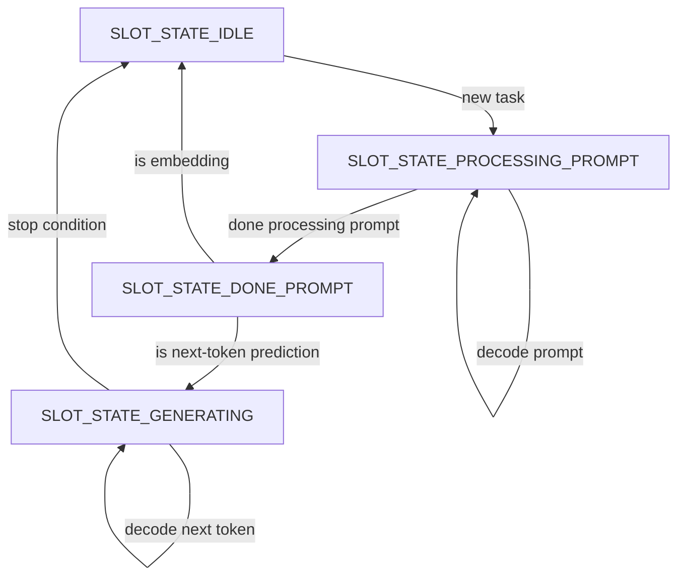

# Modulo kernel e instrumentazione di llama.cpp

## Mappatura tramite `strace`

Prima di sviluppare il modulo, è stato fondamentale comprendere come l'inferenza di `llama.cpp` si traducesse in interazioni con la GPU virtualizzata. È stato utilizzato `strace` per tracciare le System Call di tipo `ioctl` dirette al driver grafico.

```bash
strace -f -tt -e trace=ioctl ~/llama.cpp/build/bin/llama-cli \
    -m qwen2.5-0.5b-instruct-q4_k_m.gguf -p "A ball is in a yellow box..."

```

L'analisi dell'output ha permesso di individuare specifiche chiamate del driver `drm/virtgpu` (es. `virtio_gpu_execbuffer_ioctl`, `virtio_gpu_resource_create_blob_ioctl`). Questo ha fornito i target precisi da agganciare nel kernel.


## Kprobe vs Kretprobe

Per intercettare le funzioni a livello kernel, il framework offre due strumenti:

* **Kprobe:** Scatta *prima* che l'istruzione target venga eseguita.
* **Kretprobe:** Scatta nel momento in cui la funzione target *ritorna* al chiamante.

In questo caso utilizziamo la kretprobe, sfruttando il fatto che permette di eseguire:

- **Entry Handler (`entry_handler`):** Viene eseguito prima della funzione. 
    Viene usato per verificare se il processo/thread corrente è il nostro target tramite `target_pid` e,
    in caso di `descriptor_corruption`, per alterare gli argomenti passati alla funzione manipolando i registri (es. `RSI`, `RDX` su architettura x86_64).
- **Return Handler (`ret_handler`):** Viene eseguito al termine della funzione, prima di restituire il controllo a userspace. È qui che viene iniettata la
   latenza con `mdelay`, ed è qui che possiamo manipolare il valore di ritorno originale (`original_retval`) forzando un codice di errore simulando così un fallimento hardware o del driver.

---

## Analisi del Modulo Kernel `fault_injection.ko`

Il modulo è progettato per essere altamente configurabile a runtime tramite `sysfs`.

### Parametri di Selezione del Target

I seguenti parametri definiscono dove e chi colpire:

* `func_name`: Il nome della funzione del kernel da intercettare (es. `virtio_gpu_execbuffer_ioctl`).
Da inserire come argomento quando si carica il modulo.
* `target_comm`: Il nome del processo da colpire (es. `llama-cli`). Anche questo da inserire come argomento quando si carica il modulo
* `target_pid`: Il Thread ID (TID) esatto. Se impostato, ha la priorità su `target_comm`. È fondamentale per
le applicazioni multithreading per evitare di colpire thread di background al posto di quello usato per l'inferenza. Il TID viene derivato a runtime tramite l'instrumentazione
 di `server-context.cpp`.

### Parametri Temporali

Gestiscono *quando* e *per quanto tempo* iniettare il guasto:

* `target_occurrence`: Aspetta $N$ chiamate valide prima di attivare il guasto. [non usato]
* `burst_length`: Per quante chiamate consecutive mantenere attivo l'errore. [non usato]
* `trigger`: Variabile "interruttore". Quando viene scritta a `1`, resetta i contatori e arma il modulo per l'iniezione.

### Tipologie di Guasto Iniettabili

1. **Latenza (`inject_delay_ms`):** Introduce un blocco sincrono (`mdelay`) nel `ret_handler`.

```c
if (inject_delay_ms > 0) {
        pr_info("fault_hook: [LATENZA #%d] %d ms su %s\n", n, inject_delay_ms, func_name);
        mdelay(inject_delay_ms); 
    }
```

2. **Errore di Ritorno (`inject_error`):** Sovrascrive il valore restituito dalla funzione (es. per simulare un fail della ioctl). *Nota: questo fault non viene iniettato su `virtio_gpu_cmd_submit` in quanto è una funzione `void`.*

```c
original_retval = regs_return_value(regs);
if (inject_error != 0) {
    pr_info("fault_hook: [FAULT #%d] Sovrascrittura %s: da %d a %d\n",
            n, func_name, original_retval, inject_error);
    regs_set_return_value(regs, inject_error);
}
```
3. **Corruzione Parametri della funzione (`descriptor_corruption`):** Eseguita nell'`entry_handler`, manipola le strutture dati prima che vengano elaborate dal kernel. 
La metodologia adottata è quella di intercettare il payload dati della funzione bersaglio (`void *data`), che viene interpretato in maniera differente da ognuna delle funzioni esaminate, (es. `drm_virtgpu_execbuffer`) e se ne alterano alcuni campi chiave per bypassare i controlli base del kernel e testare eventuali fault.

Di seguito i dettagli delle strutture manipolate e il codice per ciascuna funzione:

* **Su `virtio_gpu_execbuffer_ioctl`**:
  Questa ioctl riceve da userspace la struttura `drm_virtgpu_execbuffer`. I campi bersagliati sono la dimensione (`size`), l'indice della coda (`ring_idx`) e il puntatore ai comandi (`command`).
```c
struct drm_virtgpu_execbuffer {
    __u32 flags;
    __u32 size;       // Modificato (Case 1)
    __u64 command;    // Modificato (Case 3)
    __u64 bo_handles;
    __u32 num_bo_handles;
    __s32 fence_fd;
    __u32 ring_idx;   // Modificato (Case 2)
    __u32 syncobj_stride;
    __u32 num_in_syncobjs;
    __u32 num_out_syncobjs;
    __u64 in_syncobjs;
    __u64 out_syncobjs;
};
```
```c
switch (descriptor_corruption) {
    case 1:
        // Caso 1: Azzera la dimensione dei comandi (sottomissione vuota)
        if (exbuf->size >= 8) {
            exbuf->size = 0;
        }
        break;
    case 2:
        // Forza un ring_idx fuori scala per far fallire la selezione della coda
        exbuf->ring_idx = 0xFFFFFFFF;
        break;
    case 3:
        // Corrompe l'indirizzo del buffer comandi
        exbuf->command = 0xFFFFFFFF;
        break;
}
```

* **Su `virtio_gpu_resource_create_blob_ioctl`**:
  Riceve la struttura `drm_virtgpu_resource_create_blob`. I campi bersagliati sono le grandezze dell'allocazione (`size`, `cmd_size`) e i flag (`blob_flags`). Si usano allineamenti forzati per superare i check sintattici (es. `IS_ALIGNED`) del kernel allocando però memoira errata.
```c
struct drm_virtgpu_resource_create_blob {
    __u32 blob_mem;
    __u32 blob_flags; // Modificato (Case 3)
    __u32 bo_handle;
    __u32 res_handle;
    __u64 size;       // Modificato (Case 1)
    __u32 pad;
    __u32 cmd_size;   // Modificato (Case 2)
    __u64 cmd;
    __u64 blob_id;
};
```
```c
switch (descriptor_corruption) {
    case 1:
        // Caso 1: Riduciamo 'size' (dimensione comando) ma manteniamo l'allineamento a PAGE_SIZE. Senza allineamento si viene intercettati dal controllo di verify_blob()
        if (blob->size > PAGE_SIZE) {
            blob->size = ALIGN_DOWN(blob->size / 2, PAGE_SIZE);
            if (blob->size == 0) blob->size = PAGE_SIZE; // Evitiamo size 0
        }
        break;
    case 2:
        // Caso 2: Riduciamo 'cmd_size' mantenendo l'allineamento a 4 byte
        if (blob->cmd_size >= 8) {
            blob->cmd_size = ALIGN_DOWN(blob->cmd_size / 2, 4);
        }
        break;
    case 3:
        // Caso 3: Invertiamo MAPPABLE (0x0001) o CROSS_DEVICE (0x0004)
        // Rimane dentro VIRTGPU_BLOB_FLAG_USE_MASK, quindi supera verify_blob()
        blob->blob_flags ^= 0x0001; 
        break;
}
```

* **Su `virtio_gpu_queue_fenced_ctrl_buffer`**:
  Manipola la struttura interna `virtio_gpu_vbuffer` usata prima dell'inserimento nella virtqueue. I campi colpiti sono il payload dati (`data_buf`), il comando VirtIO (`buf` con casting a `virtio_gpu_ctrl_hdr`), o la dimensione complessiva (`size`).
```c
// Struttura principale del buffer
struct virtio_gpu_vbuffer {
    char *buf;               // Punta all'intestazione del comando (virtio_gpu_ctrl_hdr)
    int size;                // Modificato (Case 3)
    void *data_buf;          // Modificato (Case 1)
    uint32_t data_size;
    // ...
};

// Struttura dell'intestazione VirtIO, contenuta in vbuf->buf (Case 2)
struct virtio_gpu_ctrl_hdr {
    __le32 type;             // Modificato (Case 2: Opcode del comando)
    __le32 flags;
    __le64 fence_id;
    __le32 ctx_id;
    __le32 ring_idx;
};
```
```c
switch (descriptor_corruption) {
    case 1:
        // Bit-flip nel payload DMA
        // Simula un singolo bit-flip nella RAM o sul bus dati.
        if (vbuf->data_buf && vbuf->data_size > 0) {
            uint32_t flip_off = vbuf->data_size / 2;
            ((unsigned char *)vbuf->data_buf)[flip_off] ^= 0x01;
        }
        break;
    case 2:
        // INVALID OPCODE — Corruzione del tipo di comando
        // Sostituisce l'intestazione virtio_gpu_ctrl_hdr->type con un valore errato
        if (vbuf->buf && vbuf->size >= sizeof(struct virtio_gpu_ctrl_hdr)) {
            struct virtio_gpu_ctrl_hdr *hdr = (struct virtio_gpu_ctrl_hdr *)vbuf->buf;
            hdr->type = cpu_to_le32(0xFFFF);
        }
        break;
    case 3:
        // SIZE TRUNCATION — Troncamento del comando all'header
        // Simula un DMA underrun o perdita dati sul bus.
        if (vbuf->size > (int)sizeof(struct virtio_gpu_ctrl_hdr)) {
            vbuf->size = sizeof(struct virtio_gpu_ctrl_hdr);
        }
        break;
}
```

* **Su `virtio_gpu_cmd_submit`**:
  Il campo `data` in questa funzione non viene interpretato come una struct come negli altri casi. Di conseguenza, si analizza il buffer che nelle varie run si è osservato essere composto da 24 byte. Tramite stampe durante l'esecuzione, si deduce che i byte 0-3 sono il `resource_handle` e i byte 16-23 sono il `tail_off` del Ring Buffer condiviso di Vulkan.
```c
/*
 * Mappa dedotta del buffer (24 byte):
 * [0-3]   le32 resource_handle  (Modificato nel Case 2)
 * [4-7]   le32 padding
 * [8-15]  le64 base_address
 * [16-23] le64 tail_offset      (Modificati base_address+tail_offset nei Case 1 e 3)
 */
```
```c
switch (descriptor_corruption) {
    case 1: {
        // OBIETTIVO: Bit-flip nel ring buffer condiviso.
        // Tentiamo di invertire 1 bit negli ultimi byte appena accodati prima del tail
        // per osservare un potenziale SDC (spesso però viene mascherato o porta a crash).
        uint64_t base_addr = *(uint64_t *)(payload + 8);
        uint64_t tail_off = *(uint64_t *)(payload + 16);

        if (base_addr && tail_off >= 16) {
            void __user *target_user_addr = (void __user *)(base_addr + tail_off - 8);
            unsigned char byte_val;
            if (copy_from_user_nofault(&byte_val, target_user_addr, 1) == 0) {
                unsigned char corrupted = byte_val ^ 0x01;
                copy_to_user_nofault(target_user_addr, &corrupted, 1);
            }
        }
        break;
    }
    case 2: {
        // OBIETTIVO: Invalidazione dell'identificativo del ring buffer.
        // L'hypervisor non trova il ring e ignora la sottomissione, impedendo il 
        // completamento della fence
        uint32_t *res_handle = (uint32_t *)payload;
        *res_handle = cpu_to_le32(0xDEAD);
        break;
    }
    case 3: {
        // OBIETTIVO: Azzeramento parziale dei comandi nel ring buffer.
        // Forziamo a zero gli ultimi 16 byte accodati nel ring.
        uint64_t base_addr = *(uint64_t *)(payload + 8);
        uint64_t tail_off = *(uint64_t *)(payload + 16);

        if (base_addr && tail_off >= 16) {
            void __user *target_user_addr = (void __user *)(base_addr + tail_off - 16);
            unsigned char zeros[16] = {0};
            copy_to_user_nofault(target_user_addr, zeros, sizeof(zeros));
        }
        break;
    }
}
```

## Instrumentazione `llama.cpp`

Per avere precisione  su quale token o fase dell'LLM far fallire, `llama.cpp` è stato instrumentato in `server-context.cpp` per comunicare con il modulo kernel.

### Configurazione tramite Variabili d'Ambiente

L'applicazione è stata modificata per leggere variabili di ambiente come `FI_TARGET_PHASE` (MODEL_LOAD, PREFILL, DECODE) e `FI_TARGET_TOKEN`. Questo permette di definire la campagna di test senza ricompilare il codice sorgente.

```cpp
 if (hook_initialized) return;
    hook_initialized = true;
    if (const char* p = std::getenv("FI_TARGET_PHASE")) target_phase = p;
    if (const char* t = std::getenv("FI_TARGET_TOKEN"))  target_token = std::atoi(t);
    if (const char* f = std::getenv("FI_FAULT_CODE"))    fault_code   = std::atoi(f);
    if (const char* d = std::getenv("FI_DELAY_MS"))     delay_ms     = std::atoi(d);
    if (const char* b = std::getenv("FI_BURST_LENGTH"))      burst_len    = std::atoi(b);
    if (const char* o = std::getenv("FI_TARGET_OCCURRENCE")) target_occ   = std::atoi(o);
    if (const char* c = std::getenv("FI_DESCRIPTOR_CORRUPTION")) descriptor_corruption = std::atoi(c);
```

### Isolamento del Thread

Prima di armare il modulo, il codice C++ cattura il TID del thread corrente tramite la syscall `SYS_gettid`:

```cpp
tid = static_cast<int>(syscall(SYS_gettid));

```

Questo valore viene scritto nel parametro `target_pid` del modulo. In questo modo, garantiamo che l'errore colpisca esclusivamente il thread di computazione e non i thread accessori di llama.

### Macchina a Stati per il Target "PREFILL" vs "DECODE"

(https://github.com/ggml-org/llama.cpp/pull/9283) 



Poiché `llama_decode()` viene invocata sia per il parsing del prompt iniziale sia per la generazione dei singoli token, la distinzione avviene ispezionando lo stato interno di `llama.cpp` (`slot.state`):

* Se lo slot è in `SLOT_STATE_PROCESSING_PROMPT`, ci troviamo nel Prefill.
* Se lo slot ha terminato il prompt ma `n_decoded == 0`, stiamo per calcolare il primo token. Consideriamo lo stato `SLOT_STATE_DONE_PROMPT` ancora come fase di Prefill.
* Se lo stato è `SLOT_STATE_GENERATING` siamo in fase di Decode, confrontiamo il contatore `n_decoded_before + 1` con il nostro `FI_TARGET_TOKEN` per colpire la generazione di una parola specifica.

Quando le condizioni coincidono, `trigger_fault()` scrive tutti i parametri (incluso il PID e i codici di errore) direttamente in `/sys/module/fault_injection/parameters/...` e infine scrive `1` su `trigger`, armando la Kretprobe istanti prima che parta l'effettiva inferenza verso il driver GPU.

```cpp
{
    bool is_prefill = false;
    int  n_decoded_before = -1;
    for (auto & slot : slots) {
        if (slot.is_processing()) {
            is_prefill = (slot.state == SLOT_STATE_PROCESSING_PROMPT ||
                          slot.state == SLOT_STATE_STARTED  ||
          (slot.state == SLOT_STATE_DONE_PROMPT && slot.n_decoded == 0));
            n_decoded_before = slot.n_decoded;
            break;// con --parallel 1 (cioè il default) ce n'e' solo uno di slot/job serviti contemporaneamnte
        }
    }
    if (n_decoded_before >= 0) {
        fi::hook_prefill_decode(is_prefill, n_decoded_before);
    }
}

```
---


## Guida all'Uso ed Esecuzione

### Caricamento del Modulo nel Kernel

Dopo aver compilato il modulo e averlo posizionato sulla vm, bisogna caricarlo specificando la funzione da agganciare.

```bash
sudo insmod fault_injection.ko func_name=virtio_gpu_execbuffer_ioctl target_comm=llama-cli

```

Per permettere a `llama.cpp`, che esegue in userspace senza privilegi di root, di armare il modulo in tempo reale, è necessario aprire i permessi dei parametri in `sysfs`:

```bash
sudo chmod 666 /sys/module/fault_injection/parameters/*
```

### Esecuzione 

Si può a questo punto avviare `llama-cli` passando le variabili d'ambiente per la fault injection. Nell'esempio seguente, si mira a fallire sul calcolo del **5° token** generato, iniettando l'errore `EIO` (-5) e un ritardo di 10ms.

```bash
FI_TARGET_PHASE=DECODE FI_TARGET_TOKEN=5 FI_FAULT_CODE=-5 FI_DELAY_MS=10 \
~/llama.cpp/build/bin/llama-cli \
    --no-display-prompt \
    -m ~/llama.cpp/models/qwen2.5-0.5b-instruct-q4_k_m.gguf \
    -p "A ball is in a yellow box. Someone moves the ball to a blue box. Where is the ball now?" \
    -ngl 99 \
    -st \
    --simple-io \
    --color off \
    --seed 42 \
    --temp 0 \
```

