# Sintesi dei Risultati

Questo documento raccoglie una sintesi delle metriche e delle combinazioni di parametri più rilevanti emerse dalla campagna di Fault Injection durante le 1400 run totali. 

---

## Distribuzione Globale degli Esiti 

Riepilogo complessivo della distribuzione degli esiti registrati sull'intera campagna di iniezioni:

| Esito | Conteggio | Percentuale |
| :--- | :---: | :---: |
| **Masked** | 580 | 41.4% |
| **SDC** | 0 | 0.0% |
| **App Error** | 100 | 7.1% |
| **App Crash** | 96 | 6.9% |
| **App Hang** | 275 | 19.6% |
| **Not Activated** | 349 | 24.9% |
| **Totale** | **1400** | **100.0%** |

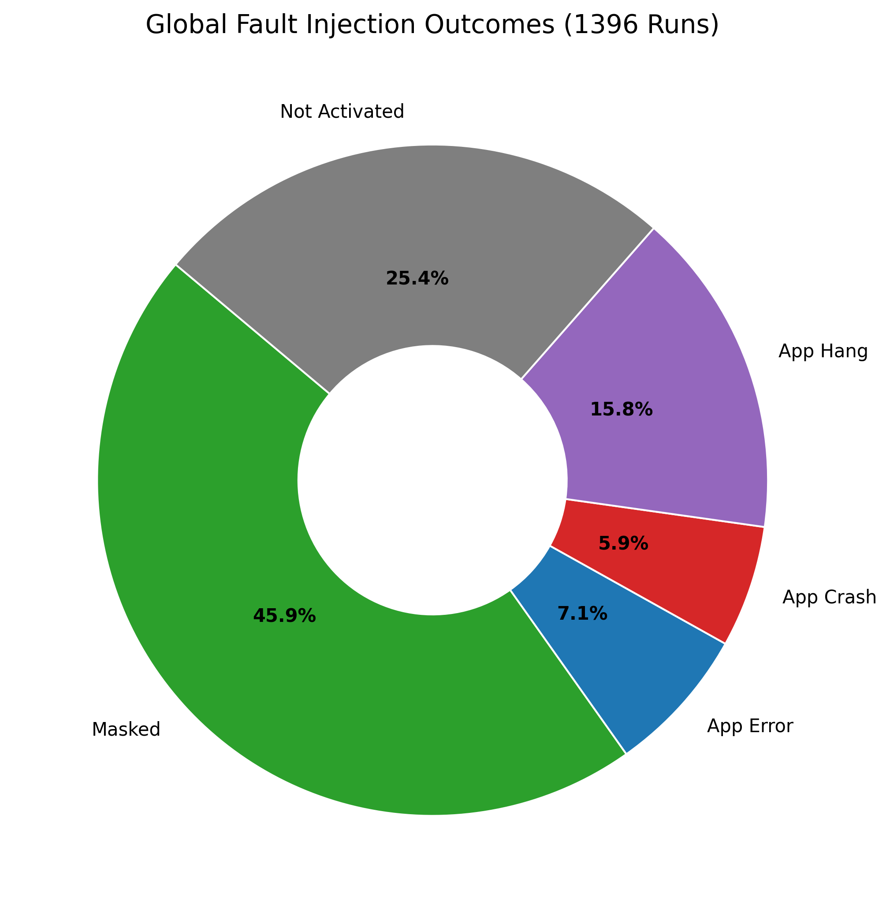

Dal grafico si nota come circa un quarto dei tentativi di iniezione (24.9%) non abbia prodotto effetti in quanto la funzione target non è stata eseguita durante la finestra di trigger (Not Activated). Nei casi in cui la funzione è stata effettivamente intercettata, nel 41.4% delle run complessive il sistema non ha manifestato comportamenti anomali, producendo l'output atteso; in questi casi il guasto è da considerarsi mascherato.

Tra i guasti con manifestazioni anomale, lo stallo applicativo (**App Hang**) rappresenta con 275 casi oltre il 58% dei fallimenti effettivi, superando nettamente crash ed errori espliciti.

---

## Modello vs. Affidabilità Effettiva 

Confronto tra le tre taglie del modello Qwen 2.5 (0.5B, 1.5B, 3B), calcolato escludendo le esecuzioni in cui la kprobe non è stata attivata.

| Modello | Not Activated Rate | Masked (Assoluto) | Masked (Effettivo) | SDC (Effettivo) | Failure Rate (Effettivo) |
| :--- | :---: | :---: | :---: | :---: | :---: |
| **qwen2.5-0.5b** | 41.6% (187/450) | 27.1% | **46.4%** | **0.0%** | 53.6% |
| **qwen2.5-1.5b** | 17.9% (85/475)  | 45.5% | **55.4%** | **0.0%** | 44.6% |
| **qwen2.5-3b**   | 16.2% (77/475)  | 50.9% | **60.8%** | **0.0%** | 39.2% |

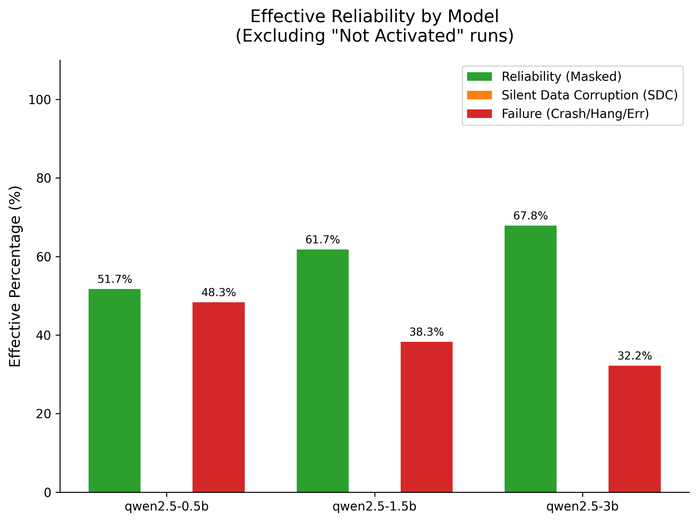

- Al crescere della dimensione del modello si riconosce un aumento progressivo del tasso di mascheramento effettivo (dal 46.4% nel modello 0.5B al 60.8% nel modello 3B). Modelli con più parametri presentano una maggiore profondità di calcolo e ridondanza interna, assorbendo meglio singoli disturbi transitori. Contemporaneamente, si osserva un aumento del tasso di mancate attivazioni in maniera inversamente proporzionale alla dimensione del modello (41.6% sul modello piccolo contro 16.2% sul 3B). La ragione risiede nel fatto che per i modelli più leggeri, l'elaborazione dei singoli token richiede un minor numero di transiti nel driver (soprattutto in fase di `DECODE`), aumentando la probabilità che il trigger armato manchi la finestra di chiamata.

- In nessuna configurazione sono state rilevate Silent Data Corruption (0.0% su 1400 test). Il sistema manifesta una risposta strettamente binaria: o il guasto viene mascherato, oppure sfocia in un blocco o errore esplicito. Questo comportamento deriva dal disaccoppiamento architetturale introdotto da Mesa Venus: i tensori e i buffer di attivazione risiedono in memoria fisica condivisa (`host-visible blob`) accessibile ad alte prestazioni senza transitare attraverso le strutture dati del driver del kernel.

---

## Funzione Target vs. Modalità di Fallimento

Distribuzione complessiva degli esiti per ciascun punto di injection del driver `virtio-gpu`.

| Funzione Kernel Target | Masked | SDC | App Error | App Crash | App Hang | Not Activated | Totale |
| :--- | :---: | :---: | :---: | :---: | :---: | :---: | :---: |
| `virtio_gpu_cmd_submit` | 70 | 0 | 0 | 36 | **81** | 37 | 224 |
| `virtio_gpu_execbuffer_ioctl` | 213 | 0 | 0 | 0 | **100** | 79 | 392 |
| `virtio_gpu_queue_fenced_ctrl_buffer` | 223 | 0 | 5 | 12 | **94** | 58 | 392 |
| `virtio_gpu_resource_create_blob_ioctl` | 74 | 0 | **95** | **48** | **0** | 175 | 392 |

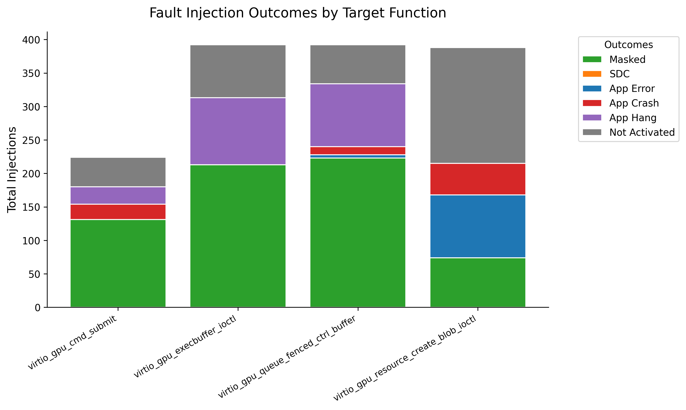

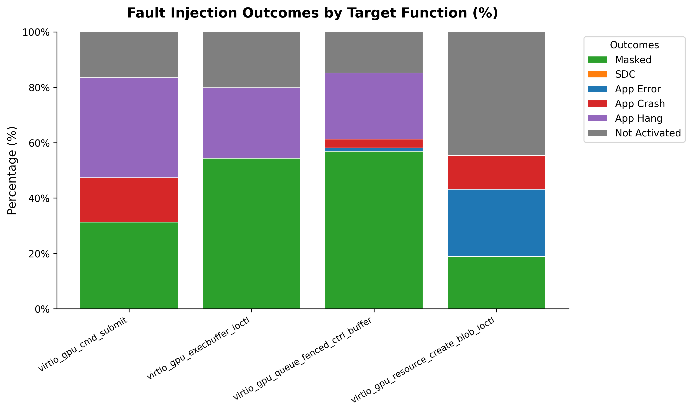

Dai dati emerge una netta distinzione nel comportamento delle diverse funzioni kernel a fronte dei guasti:

- La funzione di allocazione della memoria (`virtio_gpu_resource_create_blob_ioctl`) è l'unica a non generare mai alcuno stallo applicativo (0 App Hang). I guasti iniettati in questa ioctl vengono intercettati dallo stack utente come fallimenti di allocazione, traducendosi in 95 App Error o in 48 App Crash immediati. Inoltre, questa funzione registra il numero più alto di mancate attivazioni (175 su 392), poiché la memoria GPU viene allocata all'avvio e riutilizzata nelle fasi successive, riducendo drasticamente le chiamate durante la generazione dei token.

- Al contrario, le tre funzioni dedicate alla gestione, trasmissione e notifica dei comandi (`virtio_gpu_execbuffer_ioctl`, `virtio_gpu_queue_fenced_ctrl_buffer` e `virtio_gpu_cmd_submit`) concentrano il 100% dei 275 App Hang registrati (rispettivamente 100, 94 e 81).
  - Su `cmd_submit`, la mutazione dei campi del pacchetto `vkNotifyRingMESA` (troncamento dimensione a 4 byte, opcode non valido DEAD, o puntatore al ring buffer nullo) provoca un fallimento di parsing nel processo host `virglrenderer` con distruzione del device context. Poiché il driver guest VirtIO-GPU non integra meccanismi di timeout o watchdog sulle risposte del doorbell, il processo `llama.cpp` rimane bloccato in attesa indefinita (81 Hang) oppure termina per errore di contesto (36 Crash).

---

## Dinamica Temporale: Fasi di Inferenza e Attivazione del Carico

Analisi incrociata tra le fasi del ciclo di vita dell'LLM (`MODEL_LOAD`, `PREFILL`, `DECODE`) e le funzioni bersaglio, suddivisa per modello.

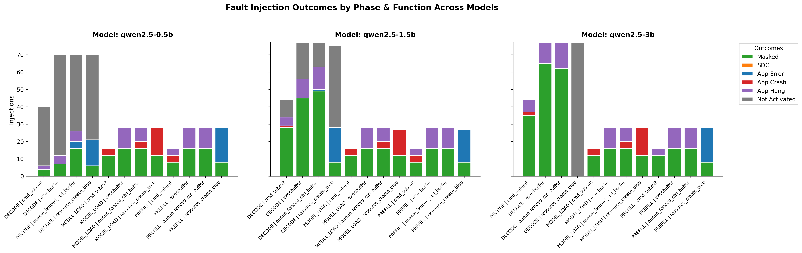

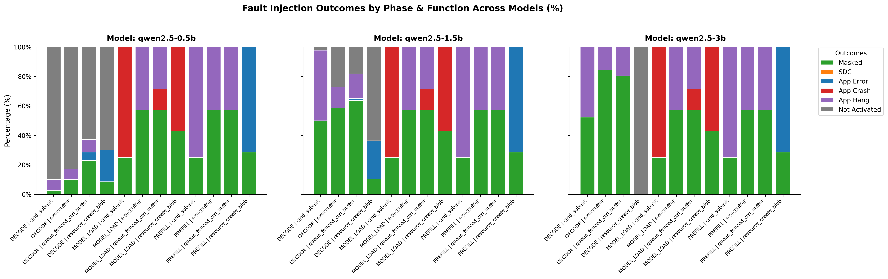

L'analisi temporale evidenzia come l'impatto dei guasti dipenda strettamente dalla fase del ciclo di vita dell'LLM in cui avviene l'iniezione:

- Le fasi di inizializzazione (`MODEL_LOAD` e `PREFILL`) presentano la vulnerabilità più elevata e la quasi totalità dei fallimenti fatali. Durante questi passaggi viene infatti caricata la struttura dei pesi, allocata la memoria e costruito il contesto iniziale del prompt.

- Al contrario, la fase di generazione (`DECODE`) mostra un tasso di mascheramento più elevato: trattandosi di un processo iterativo token per token, un disturbo transitorio circoscritto al calcolo di un singolo passo può venire assorbito senza compromettere la stabilità complessiva.

- Durante `DECODE`, nel modello da 0.5B molte iniezioni risultano non attivate (36 su 40 per `cmd_submit`) perché la computazione di un singolo token è talmente leggera da non richiedere sempre sottomissioni immediate al driver; nel modello da 3B, invece, la complessità tensoriale costringe il runtime a interagire costantemente con il driver a ogni token, portando le attivazioni al 100%. Contestualmente, l'allocazione memoria (`create_blob`) nel 3B risulta non attivata al 100% in decode, poiché la memoria viene interamente pre-allocata all'avvio.

---

## Tipologia di Guasto: Delay, Errori di Ritorno e Corruzioni Descrittori

Confronto tra le tre macro-categorie di guasto iniettate (`delay`, `error`, `corruption`) e le singole configurazioni sperimentali.

| Categoria di Guasto | Masked | SDC | App Error | App Crash | App Hang | Not Activated | Totale |
| :--- | :---: | :---: | :---: | :---: | :---: | :---: | :---: |
| **delay** | **169** | 0 | 0 | 0 | 0 | 55 | 224 |
| **error** | **279** | 0 | **57** | **36** | **0** | 132 | 504 |
| **corruption** | **132** | 0 | **43** | **60** | **275** | 162 | 672 |

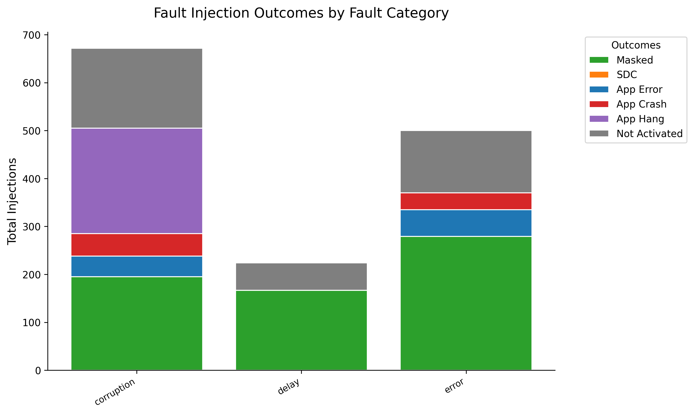

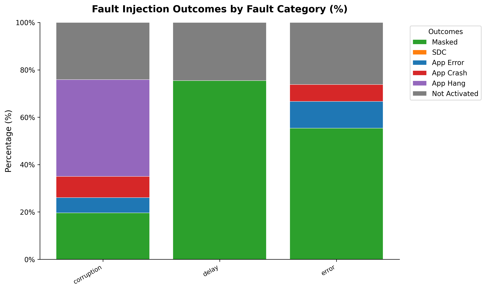

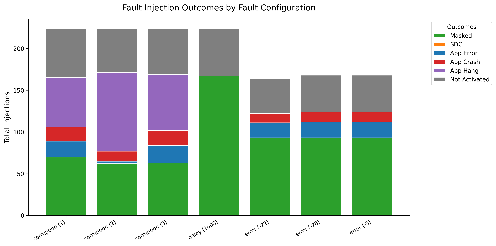

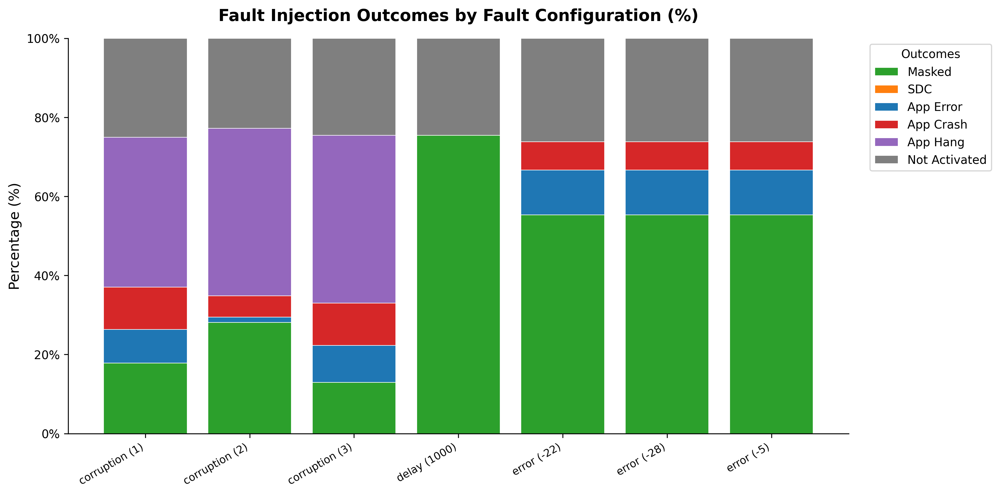

Il confronto tra le diverse modalità di iniezione evidenzia una netta separazione negli effetti prodotti:

- I ritardi temporali (`delay`), che simulano latenze del bus o della GPU di 1000ms, risultano mascherati nel 100% delle esecuzioni attivate (169 su 169). Questo dimostra che i timeout del runtime e dell'infrastruttura sono sufficientemente tolleranti da assorbire ritardi transitori senza provocare fallimenti.

- Gli errori sui codici di ritorno (`error`, con iniezione di codici errno `-5`, `-22` e `-28`) generano esclusivamente App Error (57) e App Crash (36) con 0 Hang. Quando una chiamata di sistema o una ioctl restituisce un codice di errore esplicito, l'applicazione intercetta il valore e termina immediatamente in modo controllato.

- Le corruzioni strutturali dei descrittori (`corruption`) sono le uniche responsabili di tutti i 275 App Hang registrati nella campagna. L'alterazione dei contenuti dei pacchetti o dei puntatori di notifica impedisce la sincronizzazione con l'acceleratore, lasciando i thread in attesa indefinita del rilascio di fence.

---

## Analisi delle Corruzioni dei Parametri e dei Descrittori

Comportamento delle funzioni sottoposte a mutazione strutturale dei parametri (Casi 1, 2, 3).

| Funzione Bersaglio e Caso | Obiettivo della Mutazione | Masked | Crash/Error | App Hang | Not Act. | Totale |
| :--- | :--- | :---: | :---: | :---: | :---: | :---: |
| `cmd_submit` (Case 1) | Troncamento Trasporto VirtIO (`data_size = 4`) | 8 | 12 | **26** | 10 | 56 |
| `cmd_submit` (Case 2) | Violazione Tipo Protocollo Venus (`0xDEAD`) | 8 | 12 | **27** | 9 | 56 |
| `cmd_submit` (Case 3) | Descrittore Ring Nullo (`*ring_ptr = 0ULL`) | 7 | 12 | **28** | 9 | 56 |
| `execbuffer` (Case 1) | Azzeramento Dimensione Pacchetto (`size = 0`) | 12 | 0 | **32** | 12 | 56 |
| `execbuffer` (Case 2) | Indice Coda Non Valido (`ring_idx = 0xFFFFFFFF`) | 13 | 0 | **34** | 9 | 56 |
| `execbuffer` (Case 3) | Puntatore Comandi Non Valido (`command = 0xFFFFFFFF`) | 10 | 0 | **34** | 12 | 56 |
| `queue_fenced` (Case 1) | Bit-flip nel Payload DMA | 8 | 12 | **27** | 9 | 56 |
| `queue_fenced` (Case 2) | Opcode Non Valido (`type = 0xFFFF`) | 11 | 3 | **34** | 8 | 56 |
| `queue_fenced` (Case 3) | Troncamento Comando a solo Header | 12 | 2 | **33** | 9 | 56 |
| `create_blob` (Case 1) | Riduzione `size` (Allineata a PAGE_SIZE) | 12 | **19** | 0 | 25 | 56 |
| `create_blob` (Case 2) | Riduzione `cmd_size` (Allineata a dword) | **31** | 0 | 0 | 25 | 56 |
| `create_blob` (Case 3) | Inversione Flag `MAPPABLE` (`^0x0001`) | 0 | **31** | 0 | 25 | 56 |

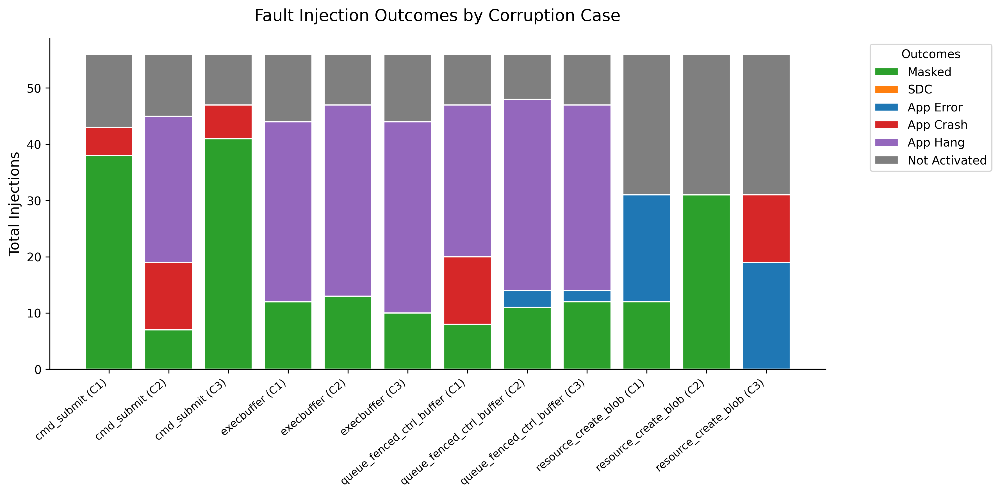

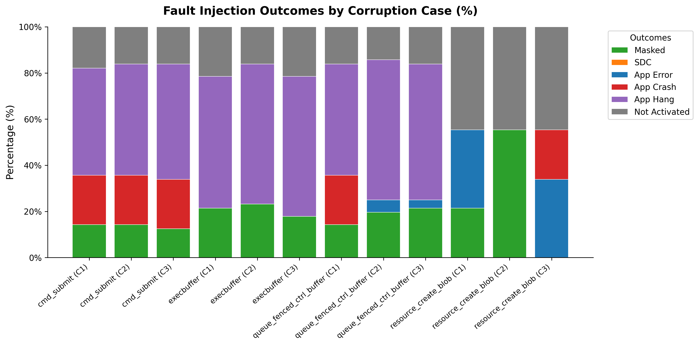

L'analisi dei 12 casi di corruzione evidenzia una maggioranza di Hang, sebbene con alcuni pattern di fallimento in base alla natura della mutazione:

- Per quanto riguarda troncamenti e alterazioni dimensionali (`size`, `data_size`): Nei canali di sottomissione comandi (`cmd_submit`, `execbuffer`, `queue_fenced`) generano principalmente App Hang (26, 32, 33 casi), oltre a 12 crash su `cmd_submit`. Su `create_blob`, ridurre il valore della dimensione di memoria allocata (`size / 2`) causa fallimenti di allocazione (**App Error**, 19 casi), mentre ridurre il valore della dimensione del solo comando (`cmd_size / 2`) viene **mascherato al 100%** delle attivazioni (31 su 31).

- Violazioni di protocollo e opcode invalidi (`0xDEAD`, `0xFFFF`, indici ring fuori limite) vengono probabilmente scartati dall'host; il relativo fence non viene mai notificato, inducendo sistematicamente **App Hang** (27 su `cmd_submit`, 34 su `execbuffer`, 34 su `queue_fenced`), anche se si presentano sporadicamente dei crash, come su `cmd_submit`.

- Riguardo le alterazioni di memoria, puntatori e flag: Invertire il flag `MAPPABLE` su `create_blob` provoca solo fallimenti (19 Error, 12 Crash, 0 Masked); azzerare o invalidare i puntatori al ring o ai comandi induce generalmente stallo (28 e 34 Hang); i bit-flip casuali nel payload DMA di `queue_fenced` mostrano esiti frammentati (8 Masked, 27 Hang, 12 Crash) in base al peso del bit corrotto.

---

## Verifica rispetto al Tipo di Task 

Verifica della distribuzione dei guasti al variare della tipologia di prompt somministrato (Aritmetica, Estrazione JSON, Ragionamento, Scelta Multipla).

| Tipologia di Task (Prompt) | Masked | App Error | App Crash | App Hang | Not Activated | Totale |
| :--- | :---: | :---: | :---: | :---: | :---: | :---: |
| **Aritmetica** | 120 (40.0%) | 15 (5.0%) | 24 (8.0%) | 63 (21.0%) | 78 (26.0%) | **300** |
| **Estrazione Dati (JSON)** | 158 (42.1%) | 34 (9.1%) | 24 (6.4%) | 70 (18.7%) | 89 (23.7%) | **375** |
| **Ragionamento** | 151 (40.3%) | 31 (8.3%) | 24 (6.4%) | 73 (19.5%) | 96 (25.6%) | **375** |
| **Scelta Multipla** | 151 (43.1%) | 20 (5.7%) | 24 (6.9%) | 69 (19.7%) | 86 (24.6%) | **350** |
| **Totale** | **580 (41.4%)** | **100 (7.1%)** | **96 (6.9%)** | **275 (19.6%)** | **349 (24.9%)** | **1400 (100.0%)** |

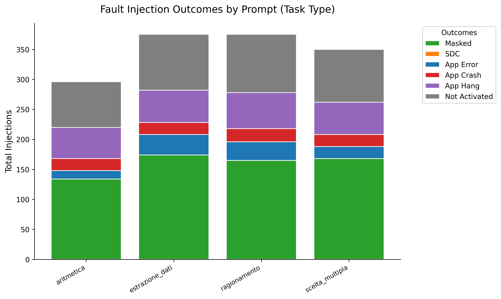

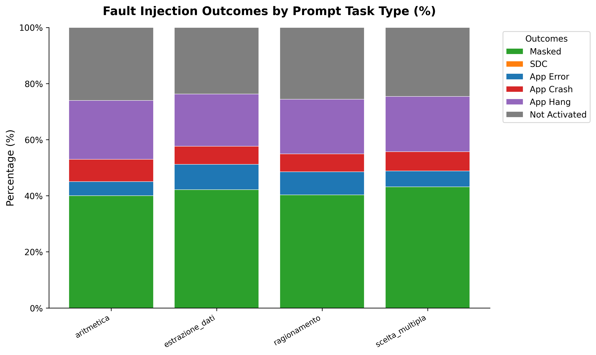

Il confronto tra i diversi prompt somministrati mostra una distribuzione degli esiti sostanzialmente uniforme:

- Tutte le categorie registrano percentuali di mascheramento comprese tra il 40% e il 43%, tassi di blocco (App Hang) attorno al 19-21% e tassi di crash tra il 6% e l'8%.

- Questa costanza nei risultati conferma che la resilienza del sistema non dipende dalla semantica o dalla complessità logica del testo generato, bensì dalle caratteristiche del driver e dell'infrastruttura di sincronizzazione sottostante.
